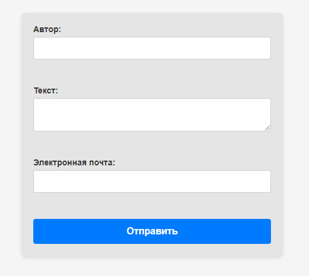

# Manager

## description
Showing work with Composer, Implementing HTML forms and working with POST data, Using PHPMailer, OOP and working with native classes, Error and exception handling, Interacting with XDebug and debugging code,
